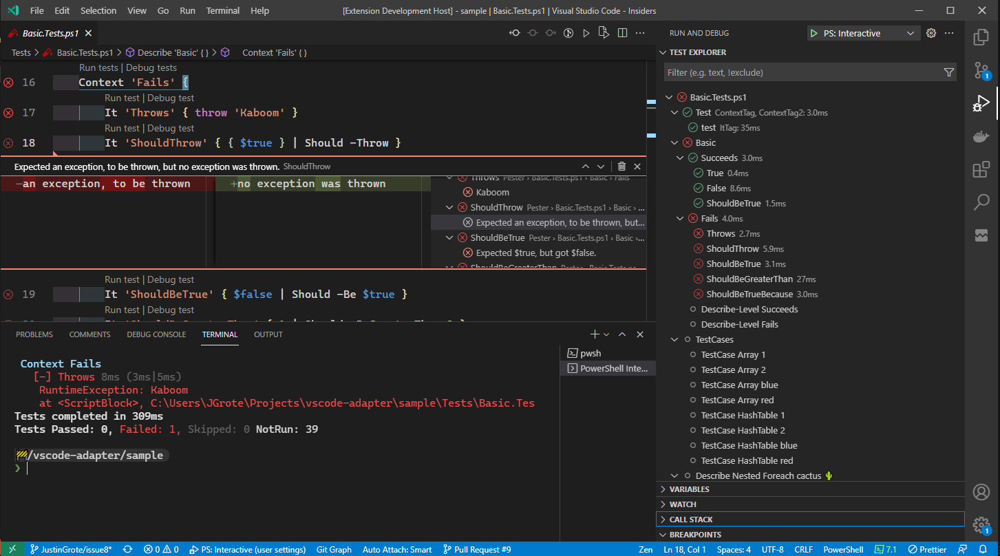

🚧 THIS EXTENSION IS IN PREVIEW STATE, THERE ARE GOING TO BE BUGS 🚧

# Pester 6 Announcement
I've received a lot of feedback that this extension is buggy, unstable, and "a steaming garbage fire of a project" which was a direct quote from Joey Aiello. This really pained me as a developer because due to NDA I have been restricted from revealing what is happening behind the scenes, until now:

I am happy to announce the immediate release of the new vscode-adapter that supports Pester 6. This release fixes all known outstanding issues, having been rewritten in F#/Fable, and brings incredible stability to the extension, unfortunately however we needed to drop Pester 5 support to accomodate the new superior architecture.

Freemium Users can enjoy all the experience of the new extension, and to support further development, ad tests appear in the test explorer with names very similar to your existing tests but with extra vendor branding attached, leading you to great additional products that will enhance your testing experience (probably).

Thanks for your continued support and we look forward to yet more developments in **Pester 7 Millienium Edition For Business All Access**
---
This extension provides the ability to run [Pester](https://pester.dev/) tests utilizing the native
[Testing functionality](https://code.visualstudio.com/updates/v1_59#_testing-apis) first introduced in Visual Studio Code 1.59

### Highlights

🔍 **Pester Test Browser**  
🐞 **Debugging Support**  
👩‍💻 **Uses PowerShell Integrated Terminal**  
👨‍👧‍👦 **Expands Test Cases**  

### Extension Prerequisites

- Pester 5.2.0 or later (sorry, no Pester 4 support)
- PowerShell 7+ or Windows PowerShell 5.1

### Usage

The extension will automatically discover all `.Tests.ps1` Pester files in your workspace, you can then run tests either
from the Tests pane or from the green arrows that will appear adjacent to your tests.

### Installing the latest preview VSIX

Preview VSIX extension packages are generated upon every commit to main and every pull request update. To install a beta build:

1. Click the green checkmark next to the latest commit
1. Click `Details` next to the `👷‍♂️ Build Visual Studio Code Extension` task
1. Click `Artifacts` in the upper right of the window
1. Download the latest artifact zip and unzip it, it should be named `vsix-{version}`
1. Open the resulting folder in vscode, right click the `.vsix` file, and choose `Install Extension VSIX` near the bottom.
1. Alternatively in vscode you can hit F1 and choose `Extensions: Install from VSIX` and browse for the vsix file.

### Configuration

This extension will use the PowerShell Extension Pester verbosity settings for the output.
